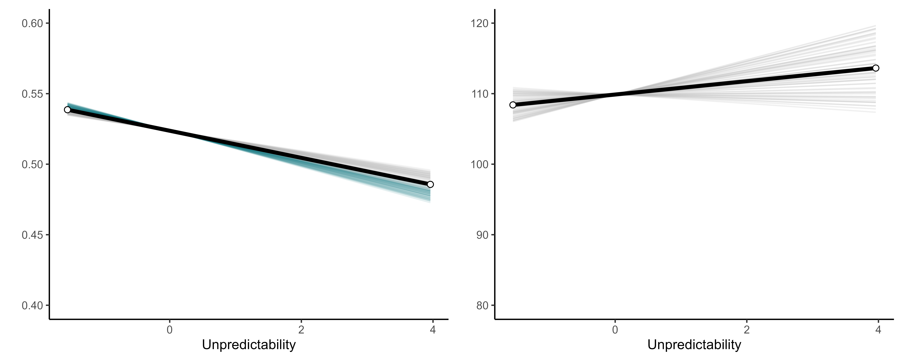

```{r setup, include=FALSE}

# Load libraries
library(tidyverse)
library(officer)
library(flextable)
library(here)
library(pwr)
library(gt)


# set up chunk options
knitr::opts_chunk$set(
  echo = F,
  fig.align = "center",
  fig.pos = "!t", 
  out.extra = "",
  fig.show = "asis",
  message = FALSE,
  warning = FALSE
)

# set up flextable for tables
set_flextable_defaults(
  font.family = "Times", 
  font.size = 10,
  font.color = "black",
  line_spacing = 1,
  padding.bottom = 1, 
  padding.top = 1,
  padding.left = 1,
  padding.right = 1
)


# Source necessary objects
power_linear      <- read_csv("../data/1_pilot/simulation/power_linear_model.csv") %>% mutate(power = round(power, 0))
power_mixed       <- read_csv("../data/1_pilot/simulation/power_mixed_model.csv") %>% mutate(power = round(power, 0))
source("pilot_stage_objects.R") # Staged results of the pilot study
source("study1_stage_objects.R") # Staged results of study 1
source("pooled_stage_objects.R") # Pooled staged results
```

#### **Attention styles in harsh and unpredictable environments. An investigation using the Drift Diffusion Model**

<br>

#### Stefan Vermeent^1,2^, Ethan S. Young^1^, Jean-Louis van Gelder^2^, & Willem E. Frankenhuis^1,2^

#### ^1^ Department of Psychology, Utrecht University, Utrecht, The Netherlands

#### ^2^ Max Planck Institute for the Study of Crime, Security, and Law, Freiburg, Germany

\pagebreak

Experiencing childhood adversity can have detrimental effects on cognitive abilities [@hackman_2010; @ursache_2016]. 
However, the hidden talents approach suggests that people living in adversity might develop specific skills that help them navigate harsh and unpredictable environments [@ellis_2017; @frankenhuis_2013]. 
For example, recent work shows that growing up in stressful environments can enhance abilities such as working memory updating and attention shifting [@fields_2021; @mittal_2015; @nweze_2020; @young_2018; @young_2022].
However, the exact nature of lowered and improved task performance remains poorly understood.
For example, some studies suggest that specific types of adversity (e.g., threat, environmental unpredictability) are associated with specific abilities independent of the task setting or content [@fields_2021; @nweze_2020].
Others only find enhancement effects under stressful [@mittal_2015; @young_2018] or more ecologically relevant [@young_2022] testing conditions.
Despite partially mixed findings, the prediction is generally that specific types of adversity directly shape specific abilities.

Another possibility, however, is that cognitive enhancements and impairments are the result of a more general process. 
That is, adversity shapes different components of cognitive performance indirectly through an underlying cognitive style. 
For example, @frankenhuis_2016 argued that exposure to environmental unpredictability and threat might require a stronger present-orientation (as opposed to being focused on the future) in order to deal with unpredictable threats and benefit from fleeting rewards. 
A style that prioritizes information in the here-and-now could explain distinct patterns of performance, such as improved updating and shifting but lowered retrieval and attention control [@fields_2021; @mittal_2015; @nweze_2020; @young_2018]. 

Yet, before we can uncover an adversity-related cognitive style, we need a better understanding of the basic cognitive processes responsible for lowered (impairments) and improved (enhancements) abilities. 
Performance measures such as reaction times (RTs) or error rates are coarse indicators of performance. 
RTs on cognitive tasks are thought to reflect a number of sequentially unfolding processes.
When the effect of adversity exposure on cognitive performance is measured by looking at RTs, enhancements or impairments might be driven by any of these subprocesses. 
Formal cognitive models such as the Drift Diffusion Model [DDM\; @forstmann_2016; @ratcliff_1998; @ratcliff_2008; @ratcliff_2015; @wagenmakers_2009] may provide insight into the specific processes that are impaired or enhanced by adversity. 
The DDM accounts for the fundamental cognitive processes underlying relatively simple, binary decision-making processes. 
The model assumes that the decision-making process constitutes a noisy information accumulation process that continues until one of two decision boundaries (corresponding to the response options) is reached. 
As soon as the accumulation process reaches a decision boundary, the process terminates and a motor response is initiated (e.g., pressing a key on the keyboard). 
The DDM accounts for the full pattern of correct RTs, incorrect RTs, and proportion of errors. 

The DDM models decision-making processes by estimating four parameters [@voss_2004]. 
The first is the **drift rate**, which indicates basic speed of information uptake as an information accumulation process.
Large drift rate values reflect more efficient processing (faster and more accurate).
The second is the **starting point** of the information accumulation process, which reflects a potential bias towards one of two response options.
Unless there is reason to believe there is a response bias, the starting point is usually fixed.
The third parameter is the **boundary separation**, which reflects the amount of information a person needs to make a decision.
Large decision boundaries indicate a more conservative response style (slower but more accurate), whereas smaller decision boundaries reflect more liberal responses (faster but less accurate).
The fourth and final parameter is the **non-decision time**, which captures all non-decision related cognitive processes initial stimulus encoding and initiating the motor response).

If people from adversity develop hidden talents, this should be reflected in specific DDM parameters. 
First and foremost, an enhanced cognitive ability would lead to more efficient information processing on tasks measuring that ability, which will be reflected in a higher drift rate (or the other way around in case of a cognitive impairment). 
Second, enhanced performance could also be (partly) driven by the ability to quickly detect relevant stimuli before the onset of the decision-making process. 
Even if the drift rate is similar across levels of adversity, faster detection and encoding of relevant stimuli would allow individuals to start accumulating information sooner. 
This would be reflected in the non-decision time. 
Finally, differences in performance across levels of adversity could be (partly) caused by the use of different strategies instead of by cognitive efficiency per se, for example, favoring speed over accuracy or vice versa. 
A tendency to adopt a specific strategy might be linked to individual differences in constructs like impulsivity. 
It is an open question whether performance differences driven by strategies should count as hidden talents [@young_2020].

The goal of the current work is twofold. 
First, we set out to assess how performance on basic attention tasks relates to two types of adversity: violence exposure and environmental unpredictability. 
We selected tasks that could relate to an underlying present-oriented cognitive style. 
Second, we leveraged DDM to better understand the nature of lowered and improved task performance. 
Towards these ends, we conducted three online studies (one comprehensive pilot study and two main studies) using an incremental preregistration approach (for all preregistrations, code and materials, see [https://github.com/stefanvermeent/attention_project/preregistrations](https://github.com/stefanvermeent/attention_project/preregistrations)).

The Introduction and Methods sections for each study were written as preregistrations before collecting the data. 
In a first comprehensive pilot study, we compared performance across three attention tasks (a Flanker task, a Cued Attention task, and a Change Detection task) as a function of childhood violence exposure and environmental unpredictability.
In study 1, we zoomed in further on the Flanker task to focus on some specific findings from the pilot study.
In study 2, ...
For each study we preregistered primary hypotheses and several exploratory analyses.
The main article addresses the primary hypotheses regarding the effects of violence exposure on attention performance and the exploratory hypotheses regarding the effects of environmental unpredictability on performance.
The supplemental materials provide an overview of the other exploratory analyses that were mentioned in the preregistrations.

# Pilot study

In the pilot study, we measured early-life exposure to violence and environmental unpredictability. 
In addition, participants completed three basic attention tasks (Flanker Task, Cued Attention Task, and Change Detection Task) that differed in the extent to which they measure or depend on an externally focused attention style.
The primary hypotheses focus on early-life exposure to violence. 
First, we expected that people with more exposure to violence during childhood would show enhanced performance compared to people from safe environments on tasks that required quickly detecting peripheral stimuli and detecting subtle changes (i.e., the Cued Attention Task and Change Detection Task). 
We expected that this effect would be explained by at least one of two DDM parameters: the drift rate and non-decision time.
Second, we expected that people with more exposure to violence during childhood would perform worse on tasks that required ignoring distracting peripheral stimuli (i.e., the Flanker Task). 
We expected that this effect would be at least partly explained by worse distractor inhibition, (operationalized using a Flanker-specific version of the DDM [@white_2011]; see [data analyses](#ddm_plan) for details).
Additional exploratory analyses focused on the association between environmental unpredictability and attention performance.

## Methods

### Participants {#participants}

Participants were 565 US-based individuals aged 18 between 18 and 30 recruited on Prolific Academic [https://www.prolific.co](https://www.prolific.co) (See Table \@ref(tab:table1) for demographics).
We decided on this age range to reduce the effect of age-related cognitive decline on speeded cognitive tasks, which becomes more pronounced after age 30 [@salthouse_2010]. 
The sample was balanced to include roughly 50% males. 
We used the MacArthur's ladder (included in Prolific's prescreening battery) for assessing perceived social-economic status (SES) to ensure about half of the sample came from lower SES backgrounds (a score of 4 or below).
Participants were eligible for the study if they were from the United States and if they spoke fluent English.

<br>

```{r table1, tab.id = "table1", tab.cap.style = "Table Caption", tab.cap="Demographic information for all studies."}
demographics_table
```
<br>

We conducted a power simulation using the *faux* package in R [@debruine_2021] to determine the optimal number of participants to include (more information including all simulation code on Github. 
We ran simulations for two scenarios: A linear regression model to test the effect of adversity (standardized) on attention performance (standardized) and a mixed regression model to test the interaction between adversity and task condition, including a random intercept for subjects. 
We ran simulations for a standardized $\beta$ of 0.10 and 0.15. 
In addition, we simulated the power to detect these effects with imperfectly recovered DDM parameters, assuming a recovery accuracy (i.e., correlation between data-generating parameter value and actually recovered parameter value) of *r* = 0.85.

In determining the final sample size, we weighed the simulation results together with our uncertainty about particular model parameters (mostly the fixed effects and sigma term for the mixed model) and the fact that this was a first, mostly exploratory pilot study. 
For the mixed model, we found that power was > .80 for the adversity X task condition interaction with *N* = 450 or more. 
For a linear main effect, detecting an effect of $\beta$ = 0.15 with .90 power would require *N* = `r pwr.r.test(r = 0.15, sig.level = 0.05, power = .90, alternative = "two.sided")[['n']] %>% round(0)`. 
When DDM parameter recovery accuracy was *r* = .85, power was `r (power_linear %>% filter(n_subjects == 500, fixed_effect == 0.15, effect == "linear_recov_main_power") %>% pull(power))/100` for *N* = 500 and $\beta$ = 0.15. 
Power was `r (power_linear %>% filter(n_subjects == 500, fixed_effect == 0.1, effect == "linear_recov_main_power") %>% pull(power))/100` under the same scenario when $\beta$ was 0.10. 
Ultimately, we decided on sampling 550 participants with an anticipated final sample size of around 500.

We applied several exclusion criteria prior to analyzing the data.
First, we excluded participants who did not complete the full study and those who had incomplete data on any of the attention tasks (*N* = `r #TBD `). 
Second, we analyzed responses to the attention checks and reversed coded items in the questionnaire part of the experiment. 
We excluded participants if they missed both attention check items or if they had suspicious response patterns (e.g., consistently endorsing high response options even when some items were reverse coded) (*N* = `r #TBD `). 

In addition, we screened the reaction times on each of the three attention tasks. 
For the Drift Diffusion analyses, it is important that each response is generated by a process of active information accumulation (i.e., a diffusion process, as opposed to guessing). 
To this end, trials with reaction times < 250 ms or > 3500 ms [@ratcliff_2015] were excluded from the analyses (*N* = `r #TBD `). 
Participants with more than 10 removed trials were excluded from the analyses (N = `r #TBD `).  

The final sample consisted of `r nrow(pilot_data)` participants.

TODO: Describe additional non-preregistered exclusion decisions

### Cognitive measures {#cogmeasures}

The attention tasks were programmed in JsPsych version 3.6.1 [@deLeeuw_2015]. 

**Cued Attention Task.** The Cued Attention Task was an adaptation of the Posner task, which measures basic spatial attention speed [@posner_1980]. 
On each trial, a left- or right-pointing arrow was presented in one of eight random locations at a distance of 300 pixels from the center of the screen. 
Participants had to indicate the direction of the arrow by pressing either the left- or right arrow key on their keyboard. 
On 50% of the trials, the arrow was preceded by a cue ('\*') in the exact same location (i.e., 'cued' trials). 
On the other 50% of the trials, the cue ('\*') was presented at the center of the screen (i.e., 'neutral' trials). 
Thus, on the cued trials, the location of the cue deterministically predicted the location of the arrow, whereas on the neutral trials the arrow always appeared in a different location.

Each trial started with a fixation cross presented at the center of the screen for 1000 ms. 
Then, the cue was presented for 250 ms either at the center of the screen or in the location where the arrow would appear next. 
Finally, the arrow was presented 250 ms after the onset of the cue and shown until a response was given. 
The Cued Attention Task began with eight practice trials (four cued and four neutral trials) in which participants received performance feedback after each trial (either "Correct!" printed in green or "Incorrect!" printed in red). 
After finishing the practice round, participants completed a single test block of 64 trials, consisting of two repetitions of all parameter combinations: arrow location (top center vs. top left vs. center left vs. bottom left vs. bottom center vs. bottom right vs. center right vs. top right) X arrow direction (left vs. right) X condition (cued vs. neutral). 
The main raw performance measures were RTs and accuracy for each condition (Cued: *M~RT~* = `r txt_ivs_dist_pilot$rt_cueing_cued$mean`s, *SD~RT~* = `r txt_ivs_dist_pilot$rt_cueing_cued$sd`; *M~accuracy~* = `r txt_ivs_dist_pilot$acc_cueing_cued$mean`, *SD~accuracy~* =  `r txt_ivs_dist_pilot$acc_cueing_cued$sd`; Neutral: *M~RT~* = `r txt_ivs_dist_pilot$rt_cueing_neutral$mean`s, *SD~RT~* = `r txt_ivs_dist_pilot$rt_cueing_neutral$sd`; *M~accuracy~* = `r txt_ivs_dist_pilot$acc_cueing_neutral$mean`, *SD~accuracy~* =  `r txt_ivs_dist_pilot$acc_cueing_neutral$sd`).

**Flanker Task.** The Flanker Task measures selective attention and response inhibition [@eriksen_1974]. 
On each trial of the Flanker task, participants were presented with a set of five arrows pointing either left or right. 
Their job was to indicate the direction of the central arrow while ignoring the flanking arrows to the left and right. 
On 50% of the trials, the flanking arrows pointed in the same direction as the central arrow (i.e., congruent trials), and on the other 50% of the trials they pointed in the opposite direction (i.e., incongruent trials). 
The arrows were randomly presented in the top-half or bottom-half of the screen. 
This was done to prevent participants from rigidly fixating on the center of the screen, which might reduce the interfering effect of the flanking arrows.

Each trial started with a fixation cross presented at the center of the screen. 
After a delay of 1000ms, the arrows were presented either in the top- or bottom-half of the screen. 
The Flanker task began with eight practice trials in which participants received performance feedback after each trial (either "Correct!" printed in green or "Incorrect!" printed in red). 
After finishing the practice round, participants completed a single test block consisting of a total of 64 trials, consisting of eight repetitions of all parameter combinations: Arrow location (top vs. bottom) X central arrow direction (left vs. right) X condition: (congruent vs. incongruent). 
Participants did not receive performance feedback during the test block. 
The main raw performance measures were RTs and accuracy for each condition (Congruent: *M~RT~* = `r txt_ivs_dist_pilot$rt_flanker_congruent$mean`s, *SD~RT~* = `r txt_ivs_dist_pilot$rt_flanker_congruent$sd`; *M~accuracy~* = `r txt_ivs_dist_pilot$acc_flanker_congruent$mean`, *SD~accuracy~* =  `r txt_ivs_dist_pilot$acc_flanker_congruent$sd`; Incongruent: *M~RT~* = `r txt_ivs_dist_pilot$rt_flanker_incongruent$mean`s, *SD~RT~* = `r txt_ivs_dist_pilot$rt_flanker_incongruent$sd`; *M~accuracy~* = `r txt_ivs_dist_pilot$acc_flanker_incongruent$mean`, *SD~accuracy~* =  `r txt_ivs_dist_pilot$acc_flanker_incongruent$sd`).

**Change Detection Task.** The Change Detection Task measures the ability to detect subtle spatial changes. 
On each trial of the change detection task, participants were presented with five colored circles against a gray background, each with a radius of 15 pixels. 
Each circle was located in a semi-random location around the central fixation cross. 
The location of each circle was sampled within a pre-specified area of 50 by 50 pixels to prevent overlap. 
Participants had 1000ms to memorize the locations of the five circles. 
After 1000ms, the circles disappeared for 500ms and then reappeared again. 
On 50% of the trials, one of the circles had moved to another location with a fixed displacement of 40 pixels in a 360 degree direction. 
On the other 50% of the trials, all circles were still in the same location as the initial memory display. 
Participants had to indicate whether they thought one of the circles changed location (by pressing the left-arrow key) or whether they thought all circles were still in the same location (by pressing the right-arrow key).
Note that the only potential difference between the memory and probe display on each trial was the displacement of *one* circle; the remaining circles were always in the same place and circles never changed color within a trial.

The change detection task started with five practice trials in which participants received performance feedback after each trial (either "Correct!" printed in green or "Incorrect!" printed in red). 
After finishing the practice round, participants completed two test blocks consisting of 25 trials each (50 trials in total). 
The design was fully counterbalanced so that each circle moved on five trials and was a different color each time it moved *between* trials. 
Participants did not receive performance feedback during the two test blocks. 
The main raw performance measures were RTs and accuracy across all trials (*M~RT~* = `r txt_ivs_dist_pilot$rt_change$mean`s, *SD~RT~* = `r txt_ivs_dist_pilot$rt_change$sd`; *M~accuracy~* = `r txt_ivs_dist_pilot$acc_change$mean`, *SD~accuracy~* =  `r txt_ivs_dist_pilot$acc_change$sd`).

### Self-report measures

See Table \@ref(tab:table2) for bivariate correlations between measures of adversity across all studies.

**Violence exposure.** Violence exposure was measured using the Neighborhood Violence Scale [NVS\; @frankenhuis_2018; @frankenhuis_deVries_2020; @young_2022] and two items assessing exposure to physical fights before age 13. 
The NVS contains seven items measuring perceived exposure to violence before age 13 (e.g., "Crime was common in the neighborhood where I grew up"). 
Participants rated each on a scale from 1 (never true) to 5 (very often true). 
The physical fighting items assessed the number of times participants witnessed fights before age 13: "Based on your experiences, how many times did you see or hear someone being beaten up in real life, before age 13?" and "How many times were you in a physical fight, before age 13?" Answers to both items ranged from 1 (0 times) to 8 (12 or more times). 
The items of the NVS were averaged together (Cronbach's $\alpha$ = `r txt_ivs_alpha_pilot$violence`). 
Similarly, we averaged the scores on the two fighting items together. 
Finally, we created a perceived violence exposure composite by standardizing the NVS and fighting composites and calculating an unweighted average.

**Environmental unpredictability.** We included several measures of environmental unpredictability across different temporal scales: 1) the Questionnaire of Unpredictability in Childhood [QUIC\; @glynn_2019], 2) A scale of perceived childhood unpredictability used in previous research [@mittal_2015; @young_2018], 3) the Confusion, Hubbub, and Order Scale [CHAOS\; @matheny_1995], 4) four items about the temporal stability of the family and social environment, 5) and four measures of objective unpredictability.
In the main text, we focus on exploratory analyses involving a composite measure of all z-transformed unpredictability measures.
We report additional exploratory analyses involving different subsets of measures in the supplemental materials.

The QUIC captures several dimensions of environmental and household unpredictability
The QUIC distinguishes between items capturing more short-term unpredictability (i.e., on the level of seconds to minutes) and more long-term unpredictability (i.e., on the level of days to months). 
We included all five scales of the QUIC: 1) Parental monitoring and involvement, 2) Parental predictability, 3) Parental environment, 4) Physical environment, and 3) Safety and security. 
We made three general changes to the original scale as described in @glynn_2019. 
First, we adapted all items to refer to experiences before age 13. 
This was done to reduce cognitive load from having to go back-and-forth between different time scales. 
Second, most items were rated on a scale of 1 (never true) to 5 (very often true) instead of the original yes/no answer format. 
An exception was made for four items of the parental environment scale which asked for more specific experiences (e.g., "I experienced changes in my custody arrangement"). 
For these items, we adopted a response scale with the options "never", "only once", "a couple times", "several times", "many times". 
Third, quantifiers such as "frequently", "often", and "There was a period of time when [...]" were dropped to better match the response scale. 
We excluded the item "My parents got divorced" because it did not fit the response format and was captured by one of the items of the perceived unpredictability scale.
Reliability of the scale was high (Cronbach's $\alpha$ = `r txt_ivs_alpha_pilot$quic_total`).

The perceived childhood unpredictability scale contained eight items measuring perceived unpredictability before age 13 (e.g, "My family life was generally inconsistent and unpredictable from day-to-day"). 
Participants rated each on a scale from 1 (never true) to 5 (very often true).
Reliability of the scale was high (Cronbach's $\alpha$ = `r txt_ivs_alpha_pilot$unp`).

The CHAOS consists of 15 items measuring the level of chaos in the household (e.g., "No matter how hard we tried, we always seemed to be running late". 
We made two changes to the original scale as described in @matheny_1995. 
First, all items were converted from the present tense to the past tense, and were endorsed as applying to participants' lives before age 13. 
Second, all items were rated on a scale of 1 (never true) to 5 (very often true) instead of the original yes/no answer format. 
This change was also implemented to reduce cognitive load by keeping the answer options the same between scales. 
Reliability of the scale was high (Cronbach's $\alpha$ = `r txt_ivs_alpha_pilot$chaos`).

One additional scale measured the stability of the family and social environment. 
On a scale of 1 (the same all the time) to 5 (constant and rapid changes), participants indicated how often the following aspects of their family and social environment changed before age 13: 1) economic status, 2) family environment, 3) childhood neighborhood environment, and 4) childhood school environment. 

Finally, we included four objective measures of unpredictability before age 13. 
Participants provided answers to the following items in an open response format: 1) "How often did you move?"; 2) "How many adults lived in your home on average?"; 3) "How many romantic partners did your mother have (not counting your father)?"; 4) "How many romantic partners did your father have (not counting your mother)?". 

```{r table2, tab.id = "table2", tab.cap.style = "Table Caption", tab.cap="Pooled bivariate correlations and descriptive statistics of measures of childhood violence exposure and environmental unpredictability across the three studies."}
iv_cor_pooled_table
```

<br>

### Procedure {#procedure}

The experiment was completed on the participants' own laptop or desktop computer and consisted of five parts: consent, attention task battery, questionnaire battery, brief demographics form, and final checks including the opportunity to give feedback on the experiment. 
Participants were allowed to refrain from answering any of the questionnaire items, but were prompted with a warning once when moving to the next page if one of the items was not answered (which they could ignore).

After providing consent, participants started with the three attention tasks. 
They were asked to complete the attention tasks in a quiet room in the house where they would be least likely to be distracted by other people or outside noises. 
The order of the tasks was counterbalanced between subjects. At the onset of the first task, the experiment went into full-screen mode to limit distractions from other programs or browser tabs. 
The size of the task stimuli was controlled between subjects using the resize plugin in JsPsych [@deLeeuw_2015].
Participants were asked to hold a creditcard (or similarly sized card) up against the screen and to increase the size of a blue rectangle on the screen until it matched the size of the creditcard. 
The stimulus display for each task was resized so that 100 pixels corresponded to 1 inch for all participants. 
After successfully resizing the screen, participants completed all three tasks. 
During the task, the cursor was hidden from the screen to minimize distractions.

After completing the attention tasks, participants completed the questionnaire battery.
Finally, we asked participants if they ever got up or were interrupted during the study, and how noisy their environment was during the attention tasks. 
The full experiment took approximately 35 minutes. 
Participants were paid £4.38 upon completing the full experiment.

### Primary data analyses {#analysis_plan}

**Multiverse analysis.** Online experiments have less experimental control than lab studies.
There are many factors that might influence performance but it is ambiguous which factors affect performance and how strong these effects are. 
Although not preregistered, we decided to quantify the robustness of our findings against a set of factors that may affect online studies by using multiverse analysis (see @simonsohn_2020 for more details).
We identified seven arbitrary analytic decisions, including or excluding 1) participants who had a recaptcha score below 0.5 (possibly indicating bots); 2) participants who did not rescale their screen at the start of the experiment (see the [procedure section](#procedure)); 3) participants who did not enter fullscreen mode prior to starting the Flanker Task; 4) participants who exited fullscreen mode at any point during the Flanker Task; 5) participants who indicated high levels of noise in their environment; 6) participants who indicated extreme interruptions during the experiment. 

### Reaction Times {#rt_plan}

For the Cued Attention Task and Flanker Task, average reaction times per participant were calculated separately for each condition (cued/neutral trials and incongruent/congruent trials, respectively). 
For the change detection task, we calculated an average reaction time across all trials. 
To meetmodel assumptions of normally distributed residuals, reaction times were log-transformed if they showed non-normal skew. 
We did not analyze proportion of errors because accuracy was nearly perfect on all tasks.
Note that the DDM analysis described below provides a full breakdown of performance both in terms of reaction times and accuracy.
For the Cued Attention Task and Flanker Task, we performed a set of linear mixed effects analyses to test adversity X task condition interactions on mean RTs.
Task condition was sum-coded (-1 and 1).
All models included a random intercept for participants. 
For the Change Detection Task, we performed linear regression to test the main effect of adversity on mean RTs.
Across separate models, adversity was operationalized as the composite measures of each violence exposure measure (primary analyses) and the composite measures of the unpredictability measures (exploratory analyses).
Significant interaction effects were unpacked using simple slopes analysis.

### Drift Diffusion Model {#ddm_plan}

For the Change Detection Task and the Cued Attention Task, we fit a standard DDM.
The exact estimation approach deviated from the preregistration, which was planned to be Maximum Likelihood (ML) estimation.
The reason for this change was that there were several issues with estimating DDM parameters for the Cued Attention task, which we later discovered were caused specifically by ML.
We therefore decided to switch to an hierarchical Bayesian version of the DDM (HDDM).
An important difference between HDDM and ML is that HDDM uses the group information to inform individual parameter estimates, whereas ML models are fitted to each individual separately.
This generally improves the accuracy of the estimation, especially when each participant has relatively few trials.

Following @voss_2013, we fitted several DDM models with increasingly strict constraints, comparing model fit using BIC.
For all tasks, model fit was highest when only boundary separation, drift rate and non-decision time were freely estimated (i.e., with all inter-trial variability parameters fixed to 0 and starting point fixed to 0.5, indicating no response bias).
In addition, model fit statistics for the Cued Attention task indicated that boundary separation should be fixed across conditions.
This is in line with the assumption that people cannot strategically change their decision threshold on a trial-by-trial level when conditions are presented randomly.

The DDM analysis of the Flanker task was done using a specialized DDM developed for Flanker data: The Shrinking Spotlight Model [SSP\; @grange_2016; @white_2018a; @white_2018b; @white_2011]. 
The standard DDM model assumes a stable drift rate over time within trials (i.e., the rate of information accumulation does not change over time). 
However, on the Flanker Task, reaction time patterns indicate that the drift rate increases over time, thus violating the basic assumption of the standard DDM [@white_2011]. 
The SSP accounts for this pattern by assuming that attention resembles a spotlight.
At first, attention is broad, but then gradually narrows down to the central arrow over time. 
Each arrow provides perceptual input. 
If the flanking arrows are congruent, all flankers take a positive value for perceptual input; if the flanking arrows are incongruent, they take a negative value for perceptual input.
The the central arrow always takes a positive value. 
The drift rate at each time point is a function of the strength of perceptual input multiplied by the amount of attention focused on each arrow. 

Attention is operationalized by two additional parameters: the initial width of the attentional spotlight and the shrinking rate of the attentional spotlight. 
The attentional spotlight is assumed to be normally distributed over the arrows, with relatively more attention toward the center arrows and less toward the peripheral arrows. 
Over time, this normal distribution narrows down to the central arrow defined by the shrinking rate, thereby gradually decreasing the interfering effect of the flankers.
Previous studies also calculated initial attention width / shrinking rate ratio, which serves as a measure of *interference*.
We preregistered that we would analyze both the ratio and the initial attention width separately.
However, we ended up analyzing the ratio only because the attention parameters were too unstable by themselves to interpret [see also @white_2018a].
Model fit was done using the *flankr* package in R [@grange_2016].

Our dependent variables included raw RTs, the drift rate, boundary separation, and non-decision time (as well as perceptual input and interference for the Flanker Task). 
For the Flanker Task and Change Detection Task, DDM parameters were submitted to a series of linear regression models with adversity as the independent variable. 
For the Cued Attention Task, DDM parameters were submitted to linear mixed effects models to test for adversity X condition interactions. 
All models included a random intercept for participants. 
Significant interactions were unpacked using simple slopes analysis.

## Results

We first analyzed associations between raw RTs and performance across all tasks.
Participants with more violence exposure had longer RTs on the Cued Attention Task ($\beta$ = `r pilot_main_eff_rt_df |> filter(dv == "Cued Attention") |> pull(median_effect_Main)`, 95% CI = `r pilot_main_eff_rt_df |> filter(dv == "Cued Attention") |> pull(Main_CI)`, `r pilot_main_eff_rt_df |> filter(dv == "Cued Attention") |> pull(p_sum_Main)` % *p*s < .05), but we did not find significant interactions between violence exposure and task condition. 
Violence exposure did not predict RTs for the Change Detection and Flanker Tasks.

Next, we analyzed DDM parameters for each task.
For the Cued Attention Tasks, only the main effect of boundary separation was significant ($\beta$ = `r pilot_main_eff_ddm_list$cueing_a$median_effect_Main`, 95% CI = `r pilot_main_eff_ddm_list$cueing_a$Main_CI`, `r pilot_main_eff_ddm_list$cueing_a$p_sum_Main` % of *p*s < .05). 
Higher levels of violence predicted more conservative responses.
We did find a small significant task version x violence exposure interaction for the drift rate ($\beta$ = `r pilot_main_eff_ddm_list$cueing_v$median_effect_Interaction`, 95% CI = `r pilot_main_eff_ddm_list$cueing_v$Interaction_CI`, `r pilot_main_eff_ddm_list$cueing_v$p_sum_Interaction` % of *p*s < .05).
However, multiverse simple slopes analyses yielded no differences in median simple effects of violence exposure.

For the Change Detection Task, we found a main effect of violence exposure on the drift rate, indicating that higher levels of violence exposure were associated with lower drift rates, ($\beta$ = `r pilot_main_eff_ddm_list$Change_v$median_effect_Main`, 95% CI = `r pilot_main_eff_ddm_list$Change_v$Main_CI`, `r pilot_main_eff_ddm_list$Change_v$p_sum_Main` % of *p*s < .05). 
There were no significant effects of violence exposure on non-decision time and boundary separation.

Finally, for the Flanker Task, we found a main effect of violence exposure on perceptual input, indicating that higher levels of violence exposure were associated with a lower quality of perceptual input ($\beta$ = `r pilot_main_eff_ddm_list$Flanker_p$median_effect_Main`, 95% CI = `r pilot_main_eff_ddm_list$Flanker_p$Main_CI`, `r  pilot_main_eff_ddm_list$Flanker_p$p_sum_Main` % of *p*s < .05). 
Surprisingly, we additionally found a main effect of violence exposure on interference (the ratio between initial attention width and the shrinking rate) indicating that higher levels of violence exposure were associated with less interference ($\beta$ = `r pilot_main_eff_ddm_list$Flanker_interference$median_effect_Main`, 95% CI = `r pilot_main_eff_ddm_list$Flanker_interference$Main_CI`, `r pilot_main_eff_ddm_list$Flanker_interference$p_sum_Main` % of *p*s < .05). 

## Discussion

In line with previous thinking [e.g., @ellis_2022; @frankenhuis_2016; @frankenhuis_2013], we initially expected people from adversity to perform better on cognitive tasks that require a broad attention scope. 
A broad attention scope might facilitate vigilance and the detection of subtle changes in peripheral information. 
However, this might come at a cost, especially for tasks that involve interference. 
Our pilot study tested these ideas by measuring performance on a Cued Attention, Changed Detection, and Flanker Task and associating it with adversity exposure. 
We expected adversity-exposure would improve performance on the Cued-Attention and Change Detection tasks but hurt performance on the Flanker Task.

In contrast to expectations, we did not find evidence for a broad adversity-related attention scope. 
In fact, the DDM analyses showed that participants with more violence exposure were generally slower to process information – as shown by the drift rate parameters of the Change Detection Task and the perceptual input parameter of the Flanker. 
However, on the Flanker Task — where we expected lowered performance — our analyses suggested that people exposed to violence experienced less interference from the flanking arrows and therefore were faster to narrow their attention to the task-relevant information. 

These findings are interesting for two reasons.
First, the Flanker is a widely used task and people exposed to adversity typically show lowered performance. 
However, using the DDM decompose performance, our pilot data suggest that lowered performance may not be caused by problems with attention control or inhibition. 
Instead, people exposed to adversity might simply extract perceptual information from the stimuli more slowly (as indicated by the perceptual input parameter). 
This effectively lowers the quality of information that people can use to guide their decision, which will be reflected in lower reaction times. 
Second, these initial findings suggest that performance might be improved through different types of interventions focused on different cognitive mechanisms. 
Specifically, people with more adversity exposure might benefit from manipulations that increase the visual quality of stimuli.
In study 1, we aimed to replicated and extend these findings on the Flanker Task.

# Study 1

The goal of study 1 was to replicate the Flanker findings in the pilot study, and to better understand the possible information processing deficits for people exposed to violence. 
Participants completed three versions of the Flanker Task: the standard version (similar to the pilot study), a version with enhanced visual information, and a version with degraded visual information.

There were two possible data patterns. 
First, if violence exposure leads to deficits in perceptual processing, we would expect lower performance across all versions of the task for violence-exposed individuals.
Alternatively, lower performance on the standard version might reflect an adaptive trade-off towards more robust cognitive functioning, even in the face of noise or perturbations [@giudice_2018]. 
In that case, we would expect more stable performance for people with more violence exposure. 
As a result, they might not benefit as much from enhanced visual information, but at the same time might be able to better maintain performance when presented with degraded information.

Similarly to the pilot study, the focus of the primary aims was on childhood exposure to violence. First, we aimed to investigate the robustness of the primary findings on the Flanker Task in the pilot study by pooling the pilot data and the data of the standard condition in the current study. Second, we aimed to extent the findings of the pilot study by investigating how Flanker performance changes across task conditions as a function of violence exposure. We expected that the task manipulations would primarily have an effect on the quality of perceptual input, thereby also affecting overall response times.
Additional exploratory analyses again focused on the association between environmental unpredictability and performance on the Flanker Task.

## Methods

### Participants

Participant recruitment was identical to the pilot study.
In total, 567 US-based people between the ages of 18 and 30 participated (See Table \@ref(tab:table1)).
We applied the same exclusion criteria as reported in the pilot study.
In total, we excluded ... (TODO).
The final sample consisted of `r nrow(study1_data)` participants.

### Flanker Task

The Flanker Task was programmed in JsPsych version 6.3.1 [@deLeeuw_2015]. 
We programmed three conditions of the Flanker Task. 
In the standard condition, the arrows were 40 pixels in size (0.4 inches) and had zero padding between them. 

In the 'enhanced' condition, the aim was to increase the quality of visual information provided by the arrows. 
To this end, we increased the arrow size by 12.5% to 45 pixels (0.45 inches), and increased padding between the arrows to 5 pixels. 
This increased the width of the Flanker display by 50% with respect to the standard display. 

In the 'degraded' condition, the aim was to decrease the quality of visual information provided by the arrows. 
The arrow size and padding were the same as in the standard version, but both flanking and target arrows were rotated 45$^\circ$. 
Therefore, they provided more noisy information about their horizontal direction. 
We had no strong *a priori* expectations about how performance of adversity-exposed people might be affected by specific types of stimulus degradation (e.g., arrow rotation, decreasing stimulus contrast). 

Participants completed each condition of the Flanker Task separately in different blocks. 
The presentation order of the conditions was randomized.
Each condition consisted of 64 trials. 
For the degraded condition, participants completed four repetitions of all parameter combinations: Arrow location (top vs. bottom) X central arrow direction (left-up vs. left-down vs. right-up, vs right-down) X congruency: (congruent vs. incongruent).
For the standard and enhanced condition, participants completed eight repetitions of all parameter combinations to match the number of trials in the degraded condition: Arrow location (top vs. bottom) X central arrow direction (left-up vs. left-down vs. right-up, vs right-down) X congruency: (congruent vs. incongruent).
Across all three conditions, the arrows were randomly presented in the top-half or bottom-half of the screen at 300 pixels from the center of the screen. 
This was done to prevent participants from rigidly fixating on the center of the screen, which might reduce the interfering effect of the flanking arrows. 
Each trial started with a fixation cross presented at the center of the screen. 
After a delay of 1000ms, the arrows are presented either in the top- or bottom-half of the screen. 

Prior to each block, participants performed eight practice trials of the current condition. 
During practice, participants received performance feedback after each trial (either "Correct!" printed in green, "Incorrect!" printed in red, or "Too slow!" printed in red if their response latency exceeded 2000 ms).
After completing the practice trials, participants completed each block with the opportunity to take a break in between.
At the onset of each block, participants were told what the current condition was.
No performance feedback of any kind was provided during the test blocks.
The main performance measures were RTs and accuracy for each condition.

### Self-report measures

The self-report measures were almost identical to those used in the pilot study, with a number of small differences. 
Based on participant feedback in the pilot study, we changed all mentions of 'parent(s)' across questionnaires to 'caregiver(s)' (e.g., "At least one of my caregivers had punishments that were unpredictable). 
We also added a question asking about the participant's exact family composition.

### Procedure

The procedure was identical to the pilot study. 
The full experiment took approximately 30 minutes. 
Participants were paid £3.75 upon completing the full experiment.

### Data analyses

**Multiverse analysis.** We included the same arbitrary decisions in the multiverse analyses as in the pilot study.
For the pooled analyses, there was one minor change in the arbitrary decisions with regards to the screen rescaling procedure.
In the current study, we made a change to the screen rescaling procedure using a credit card. 
Specifically, we changed to initial size of the resize box from 100px to 300px. 
This way, the stimulus display would still be reasonably close to the intended size if participants did not engage in any resizing. 
However, this led to a change between the pilot study and the current study, which is particularly important for the pooled analysis as rescaling (yes or no) was included as an arbitrary exclusion decision in the multiverse analyses. 
To solve this issue, we decided to include this decision with four combinations: 1) exclude non-scalers in both studies; 2) include non-scalers in both studies; 3) exclude non-scalers in pilot study, include non-scalers in study 1; 4) include non-scalers in pilot study, exclude non-scalers in study 1.

For each analysis, we report the median $\beta$s, 95% confidence intervals, and the proportion of *p*-values < .05 across all analytic decisions. For the primary analyses, we used a bootstrapping technique to compute overall *p*-values to assess whether the obtained median $\beta$ is significantly larger than zero [@simonsohn_2020].

**Primary analyses.** To address the first primary aim, we pooled the Flanker data of the pilot study and the current study, using the standard condition of the current study.
For the pooled effect of violence exposure on each of the DDM parameters, we ran initial linear models including violence exposure as main predictor and study number as a covariate (effect-coded with -1 for the pilot study and 1 for study 1).
Study number was necessary as a covariate because we realized after data collection that we programmed a different vertical distance from the center of the stimuli compared to the pilot study (300px, while we used a distance of 600px in the pilot study).
The pooled effect of violence exposure on raw RTs was assessed through linear mixed models with study number included as a covariate and including a random intercept per participant.

To address the [second primary aim](#primary), we analyzed the effect of violence exposure and Flanker condition type (within the current study only) on Flanker performance using linear mixed effects models with a random intercept per participant. 
The main dependent variables were mean RTs and the SSP parameters: Perceptual input, boundary separation, non-decision time, and the interference effect (initial attention width / shrinking rate). 
For each outcome measure, we ran two separate models: One comparing the standard condition with the enhanced condition, and one comparing the standard condition with the degraded condition. 
In both models, condition was dummy-coded using the standard condition as the reference group.

## Results

### Pooled analysis

The pooled multiverse results across the two studies of the effects of violence exposure (primary analysis) and unpredictability (exploratory analysis) are summarized in Figure \@ref(fig:figure1) and Table \@ref(tab:table3).
The results for both types of adversity showed a similar pattern.
Higher levels of violence exposure were associated with a lower quality of perceptual input ($\beta$ = `r condition_pooled_results_list$p_vio$median_effect`, 95% CI = `r condition_pooled_results_list$p_vio$CI`, `r condition_pooled_results_list$p_vio$p_sum` % of *p*s < .05).
Similarly, higher levels of unpredictability were also associated with a lower quality of perceptual input ($\beta$ = `r condition_pooled_results_list$p_unp$median_effect`, 95% CI = `r condition_pooled_results_list$p_unp$CI`, `r condition_pooled_results_list$p_unp$p_sum` % of *p*s < .05).
Contrary to the results of the pilot study, more violence exposure was not associated with differences in the amount of interference ($\beta$ = `r condition_pooled_results_list$interference_vio$median_effect`, 95% CI = `r condition_pooled_results_list$interference_vio$CI`, `r condition_pooled_results_list$interference_vio$p_sum` % of *p*s < .05).
Finally, we also did not find an association between unpredictability and the amount of interference ($\beta$ = `r condition_pooled_results_list$interference_unp$median_effect`, 95% CI = `r condition_pooled_results_list$interference_unp$CI`, `r condition_pooled_results_list$interference_unp$p_sum` % of *p*s < .05).

<br>

```{r figure1, fig.id = "figure1", fig.cap.style = "Figure Caption", fig.cap="Pooled multiverse results for the associations between adversity and flanker performance. (a) visualizes the multiverse interaction effects, with the thick black lines denoting the median slope and the thin grey/blue lines denoting effects across each arbitrary decision. Grey lines indicate non-significant effects (*p* > .05) and blue lines indicate significant effects (*p* < .05). (b) plots sorted beta coefficients across each arbitrary decision. (c) plots the percentage of variance that each arbitrary decision explains in the standardized effect."}

```

<br>

```{r table3, tab.id = "table3", tab.cap.style = "Table Caption", tab.cap="Standardized effects of violence exposure and unpredictability on Flanker performance after pooling the data of the pilot study and study 1."}
condition_pooled_results_table
```

<br>

As can be seen in Figure \@ref(fig:figure1), the decision to include/exclude participants was one of the biggest sources of variance in the regression estimates.
This was despite our success in bringing the proportion of non-scalers down from `r pilot_data |> summarise(n = sum(round(scale_factor,4)==0.3081)/n()*100) |> pull() |> formatC(digits = 2, width = 3, flag = "0", format = 'f')`% to
`r study1_data |> summarise(n = sum(round(scale_factor,4)==0.9007)/n()*100) |> pull(n) |>  formatC(digits = 2, width = 3, flag = "0", format = 'f')`% in the current study.
To a lesser extent, other influential decisions were to include/exclude people who exited fullscreen at some point during the experiment and to include/exclude participants with who experienced many interruptions.

### Flanker conditions

The main effects of task condition on the quality of perceptual input were in the expected direction: Relative to the standard condition, the quality of perceptual input was higher in the enhanced condition ($\beta$ = `r study1_condition_vio_results_list$p_enhanced$median_effect_Condition`, 95% CI = `r study1_condition_vio_results_list$p_enhanced$condition_CI`, `r  study1_condition_vio_results_list$p_enhanced$p_sum_Condition`% of *p*s < .05) and lower in the degraded condition ($\beta$ = `r study1_condition_vio_results_list$p_degraded$median_effect_Condition`, 95% CI = `r study1_condition_vio_results_list$p_degraded$condition_CI`, `r study1_condition_vio_results_list$p_degraded$p_sum_Condition`% of *p*s < .05).
The task manipulations also influenced the amount of interference. 
Relative to the standard condition, interference was lower in the enhanced condition ($\beta$ = `r study1_condition_vio_results_list$interference_enhanced$median_effect_Condition`, 95% CI = `r study1_condition_vio_results_list$interference_enhanced$condition_CI`, `r study1_condition_vio_results_list$interference_enhanced$p_sum_Condition`% of *p*s < .05).
Unexpectedly, interference was also lower in the degraded condition ($\beta$ = `r study1_condition_vio_results_list$interference_degraded$median_effect_Condition`, 95% CI = `r study1_condition_vio_results_list$interference_degraded$condition_CI`, `r study1_condition_vio_results_list$interference_degraded$p_sum_Condition`% of *p*s < .05), suggesting that the angle in the flanking arrows reduced interference relative to the standard condition.

We did not find any task condition x violence exposure interactions, but a main effect for interference emerged. 
First, higher levels of violence exposure were associated with more experienced interference in the standard condition ($\beta$ = `r study1_condition_vio_results_list$interference_enhanced$median_effect_Violence`, 95% CI = `r study1_condition_vio_results_list$interference_enhanced$Violence_CI`, `r  study1_condition_vio_results_list$interference_enhanced$p_sum_Violence`% of *p*s < .05).
None of the other SSP parameters were significantly associated with violence exposure.
This pattern of results is inconsistent with the pooled results reported above, which show a negative association with perceptual input but not with interference.

We also ran exploratory analyses on the association between environmental unpredictability and Flanker performance.
We found a significant main effect of unpredictability on the quality of perceptual input, with higher levels of childhood unpredictability being associated with a lower quality of perceptual input, ($\beta$ = `r study1_condition_unp_results_list$p_enhanced$median_effect_Unpredictability`, 95% CI = `r study1_condition_unp_results_list$p_enhanced$Unpredictability_CI`, `r study1_condition_unp_results_list$p_enhanced$p_sum_Unpredictability`% of *p*s < .05).
We also found a significant main effect of unpredictability on the amount of interference, with higher levels of childhood unpredictability being associated with more interference, ($\beta$ = `r study1_condition_unp_results_list$interference_enhanced$median_effect_Unpredictability`, 95% CI = `r study1_condition_unp_results_list$interference_enhanced$Unpredictability_CI`, `r study1_condition_unp_results_list$interference_enhanced$p_sum_Unpredictability`% of *p*s < .05).
Note that the main effect of interference was not found in the pooled analyses reported above.

In addition, there was a significant task version x unpredictability interaction in the degraded task condition, ($\beta$ = `r study1_condition_unp_results_list$interference_degraded$median_effect_Interaction`, 95% CI = `r study1_condition_unp_results_list$interference_degraded$Interaction_CI`, `r study1_condition_unp_results_list$interference_degraded$p_sum_Interaction`% of *p*s < .05).
Participants with high levels of unpredictability tended to experience more distractor interference on the standard task version (*b* = `r study1_simslopes_unp_list$interference_flanker_Degraded$median_ss_Standard`, `r study1_simslopes_unp_list$interference_flanker_Degraded$p_sum_Standard`% of *p*s < .05), compared to participants with lower levels of unpredictability. However, the degraded task condition reduced this interference effect (*b* = `r study1_simslopes_unp_list$interference_flanker_Degraded$median_ss_degraded`, `r study1_simslopes_unp_list$interference_flanker_Degraded$p_sum_degraded`% of *p*s < .05).
We did not find any significant interaction effects in the enhanced condition.

## Discussion

The goal of this study was to replicate and extend the findings of the pilot study.
The findings of study 1 were inconsistent with the pilot study in a couple of ways.
First, whereas performance differences were predominantly found across levels of violence exposure and not environmental unpredictability, this pattern seemed to be reversed in the current study.
Second, we did not replicate the unexpected finding that higher levels of adversity were associated with *less* flanker interference.
Instead, adversity either led to no differences in interference .
Finally, while decreasing or increasing the perceptual quality of the arrows did affect the quality of perceptual processing across all participants, it did not reduce the interference effect difference between people with higher and lower levels of adversity.

Pooling data across the two studies, a more consistent pattern of performance emerged.
Effects were more similar across violence exposure and unpredictability.
First, participants with more adversity exposure extracted lower-quality information from the stimuli.
However, we did not find an association between adversity and the amount of interference.
Thus, the pooled analyses suggest that people with more exposure to violence *and* unpredictability process information more slowly, but are not necessarily more easily distracted by task-irrelevant information.
This is intriguing because it suggests that performance differences across levels of adversity are driven by relatively low-level perceptual differences and not by higher-level executive functions.
This interpretation of performance is quite different than previous research, which suggests that people exposed to adversity lack will-power, self-control, and are easily distracted [e.g., @farah_2006; @fields_2021; @mezzacappa_2004; @noble_2005].

Generally speaking, the results of these first two studies are not in line with our initial predictions about a present-oriented attention style.
Although we expected such a style to lead to faster speed of perceptual processing on attention tasks, we generally found the opposite pattern.
One reason for this might be that a present-oriented attention style leads people from adversity to process information more holistically, which would lower the depth of perceptual processing of any individual stimulus.
Another related reason might be that an external, present-oriented attention style extends beyond the computer screen to all of their immediate environment.
Both of these are potential mechanistic explanations for a lowered quality of perceptual processing that would be in line with a specialized attention style.
In study 2, we aimed to replicate the broader findings from study 1 (lowered perceptual input but no differences in interference) and to investigate if and how the lower quality of perceptual processing was associated with a more holistic style of attention.


# Study 2

<...>

## Methods

## Results

## Discussion

## General discussion


\pagebreak

# References {#refs}

